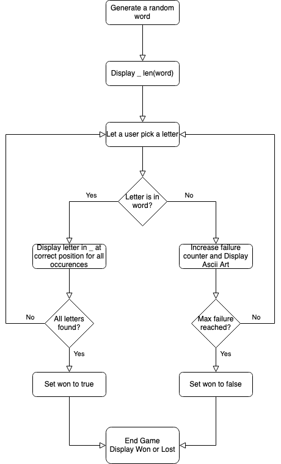

# Hangman
This is a simple python implementation of the game Hangman played fully in the Terminal.
It is fully written with TDD. 

How to use:
1. Activate your virtualenv.
2. run: `pip install -r requirements.txt` in your shell.
3. run: `python3 play.py`
4. Try to guess the word before too many failures

Preparation:

