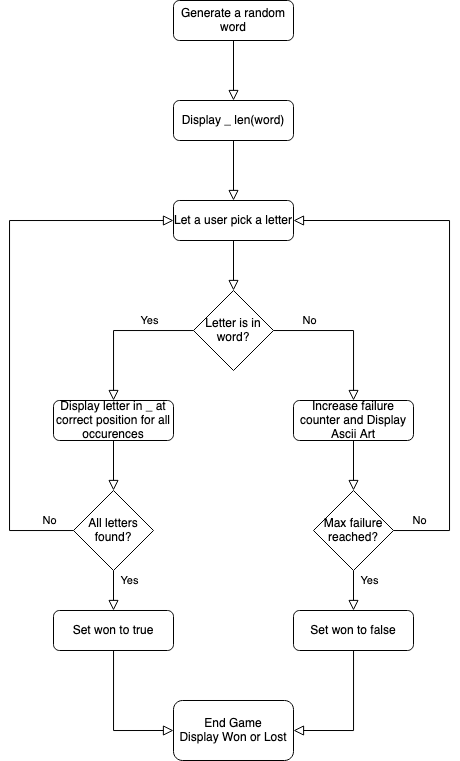

# Hangman
This is a simple python implementation of the game Hangman played in the Terminal.

## How to use

On Linux and Mac:
1. Clone the repo
2. navigate to inside the directory `cd hangman`
3. on the first use run: `source setup.sh`
4. on subsequent runs check if the venv is activated. If not run: `activate`
5. run: `play_hangman`

On Windows:

1. Follow [this guide to install Bash](https://www.howtogeek.com/249966/how-to-install-and-use-the-linux-bash-shell-on-windows-10/)
2. navigate to a bash shell
3. Follow to the runbook for normal OSs 😇

## Flowchart:

